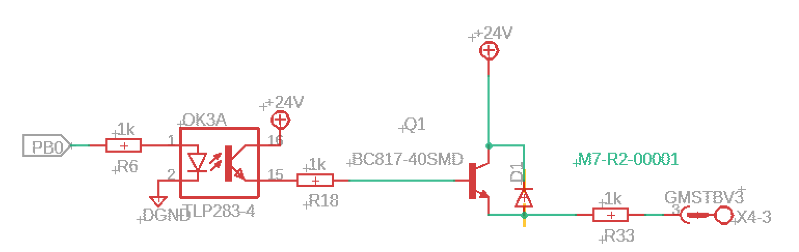

This is the first Prototype of Open Plc Controller Board Yılkı.This project devoloped with Eagle
Project started 2024.
First Protype doesn't have built in Power,mcu circuits. This PT1 is only creating for testing input,output and Rs485 line.
I'm not a hardware engineer so project maybe have faulty designs.This Board using Stm32f0 Discovery board to handle inputs and outputs.
You can see inputs state by LED.But power calculations are wrong so I'm not soldered the Leds and their resistors.In theory boards outputs can drive relay but not tested. 

Input Side:
Inputs Are Designed sink (0v Common).Protected by TVS diode and optocoupler.Added RC filter for ripples.

Output Side:
Outputs are Designed source(24V Common).Outputs Protected by Optocoupler and reverse diode for relay.

Full Duplex RS-485:
This circuit is Full Duplex Rs-485 line

